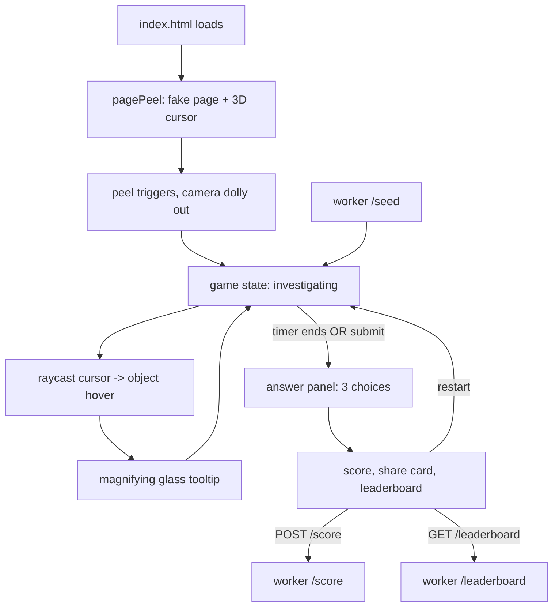

# Bug Detective jam build

## Concept lock

You are a 3D cursor mascot. The page you load *becomes* the game in the first 15 seconds. You investigate one hand-crafted desktop diorama for ~90 seconds, find the anomaly, pick the bug from 3 choices, get scored. New anomaly each day (daily seed). Leaderboard for jam-week voter retention.

## Folder layout (new)

```
bug-detective/
  index.html
  package.json, package-lock.json
  vite.config.ts, tsconfig.json, vitest.config.ts
  README.md
  public/
    sounds/                       (8 SFX + 1 music track)
  src/
    main.ts                       entry: state machine wiring
    style.css
    vite-env.d.ts
    three/
      createScene.ts              copied from tower-defense, tweaked palette
      cameraRig.ts                copied from tower-defense
    input/
      inputManager.ts             copied from tower-defense
      actions.ts                  hover/click/submit/restart
    intro/
      pagePeel.ts                 the wow opener animation
      cursorTracker.ts            3D cursor mesh tracks real mouse on a plane
    cursor/
      mascotMesh.ts               low-poly procedural cursor character
    scene/
      desktopDiorama.ts           one 3D room (desk + monitor + props)
      anomalies.ts                10+ anomaly definitions, seeded picker
    game/
      gameState.ts                intro -> investigating -> answering -> results
      timer.ts
      score.ts                    base - time*k - clues*k
    ui/
      hud.ts                      timer + magnifying glass tooltip
      answerPanel.ts              3-choice multiple choice
      shareCard.ts                canvas-rendered share image
      leaderboard.ts              fetch + render top scores
    api/
      seedClient.ts               GET /seed
      scoreClient.ts              POST /score
  worker/
    index.ts                      forked from shooting-game/worker
    wrangler.toml                 new KV namespace
  tests/
    anomalies.test.ts             deterministic seed -> same anomaly
    score.test.ts                 scoring math edge cases
```

Update root [README.md](README.md) to list three apps: `shooting-game/`, `tower-defense/`, `bug-detective/` (jam target).

## Reuse map

From [tower-defense/src/three/createScene.ts](tower-defense/src/three/createScene.ts), [tower-defense/src/three/cameraRig.ts](tower-defense/src/three/cameraRig.ts), [tower-defense/src/input/inputManager.ts](tower-defense/src/input/inputManager.ts), [tower-defense/src/input/actions.ts](tower-defense/src/input/actions.ts) — copy as-is, tweak palette/bindings.

From [shooting-game/worker/index.ts](shooting-game/worker/index.ts) — fork, replace the `character` query param with a fixed `puzzleId = "bug-detective-v1"`. Keep the daily-seed hash function (it already does FNV-1a on the date).

Drop everything else from both apps. The jam game is its own thing.

## Architecture



## Wow opener (Day 5-6, the riskiest piece)

The signature moment. How it works:

1. Page loads showing a flat textured plane that fills the viewport. Texture = a fake personal-homepage screenshot ("welcome to my page" / generic blog look). Real OS cursor moves normally over it.
2. A 3D cursor mascot mesh is overlaid, tracking the mouse position via raycast onto that plane (looks like the cursor is sitting on the page).
3. After ~1.5s, animation kicks in: cursor *tilts up*, *jumps* a small distance Y+, mesh tilt persists.
4. Plane "peels": vertex shader rolls the plane from the bottom edge upward, OR plane fragments into pixel particles, OR plane texture fades while the plane scales away (pick whichever looks best on Day 5 prototype).
5. Camera dollies backward and downward, revealing: that plane was the **back wall** of a 3D room. The room *is* the diorama.
6. Cursor falls/lands on the desk surface. Investigation begins.

**Fallback if the peel doesn't sell on Day 6:** simpler intro — camera starts inside the textured plane, dollies back, plane fades. Less wow but ships. Decision gate is end of Day 6.

## One case, multiple anomalies

The "case" is a single hand-crafted desk scene. Each daily seed picks **1 of ~10 anomalies** as the active bug, plus generates 2 distractor near-miss choices. This gives 10 days of fresh content from one scene.

Anomaly pool (build at least 10):

- Calendar shows tomorrow's date
- Mug has your name printed on it
- Clock hands rotate counter-clockwise
- Monitor reflection shows a different room
- Photo frame contains your own face
- Sticky note reads "they're behind you"
- Pen floats 2mm above the desk
- Lamp shadow points toward the light
- Coffee steam goes downward
- Open book has every page blank

Each anomaly = a tagged object in [bug-detective/src/scene/desktopDiorama.ts](bug-detective/src/scene/desktopDiorama.ts) plus a `revealText` and 3 distractor labels in [bug-detective/src/scene/anomalies.ts](bug-detective/src/scene/anomalies.ts).

## Worker fork

Copy [shooting-game/worker/index.ts](shooting-game/worker/index.ts) to `bug-detective/worker/index.ts`. Changes:

- Drop `character` URL/body param. Add `puzzleId` (always "bug-detective-v1" for jam).
- Add `score` payload field `cluesUsed: number` for tiebreakers.
- Keep `dailySeed(date)` function unchanged.
- New KV namespace `BUG_LB`. Update [bug-detective/worker/wrangler.toml](bug-detective/worker/wrangler.toml) accordingly.

## Day-by-day schedule (today is Sat Apr 18; deadline Fri May 1, 13:37 UTC)

- **Day 1, Sat Apr 18:** Scaffold `bug-detective/`. Copy Three.js + input files. Build cursor mascot mesh procedurally (faceted diamond head + magnifying-glass arm). Milestone: dev server shows the mascot.
- **Day 2, Sun Apr 19:** Desktop diorama scene + lighting pass (warm lamp, cool ambient). Camera rig static 3/4 view. Cursor follows mouse via raycast onto desk plane. Milestone: scene looks like a place.
- **Day 3, Mon Apr 20:** Anomaly system + 10 anomalies authored. Hover -> raycast -> magnifying glass tooltip. Milestone: I can find the bug manually.
- **Day 4, Tue Apr 21:** Answer panel + score formula + game state machine + 90s timer. Milestone: complete loop intro stub -> game -> result.
- **Day 5, Wed Apr 22:** Wow opener part 1: fake-page plane + 3D cursor tracking + initial "looks normal" feel.
- **Day 6, Thu Apr 23:** Wow opener part 2: peel animation + camera dolly reveal + landing. Decision gate end of day: ship peel or fall back to simpler intro.
- **Day 7, Fri Apr 24:** Fork worker, deploy to Cloudflare with new KV namespace. Wire `seedClient` + `scoreClient`. Milestone: production worker live (deploy early to validate infra).
- **Day 8, Sat Apr 25:** Share card (canvas-rendered PNG + Twitter intent URL). Leaderboard panel. "Tomorrow's bug in HH:MM:SS" countdown.
- **Day 9, Sun Apr 26:** Audio (1 ambient track + 8 SFX) + post-processing (bloom on lamp, vignette) + cursor idle bob.
- **Day 10, Mon Apr 27:** Mobile gate (detect mobile -> show "best on desktop" + simplified flow without peel). Cross-browser test on Chrome/Safari/Firefox.
- **Day 11, Tue Apr 28:** Title screen + outro + settings (mute, restart). Verify Vibe Jam widget present in built `dist/index.html` via existing [shooting-game/scripts/check-jam-widget.sh](shooting-game/scripts/check-jam-widget.sh) pattern (port to bug-detective).
- **Day 12, Wed Apr 29:** Deploy client to Cloudflare Pages. End-to-end QA on production URL. Bug bash.
- **Day 13, Thu Apr 30:** BUFFER for fixes.
- **Fri May 1, before 13:37 UTC:** Submit to https://vibej.am/2026/.

## Validation checklist before submission

- Deployed URL loads in <3s on a fresh browser tab
- Wow moment hits in first 15 seconds
- Game playable end-to-end (intro -> investigation -> answer -> score -> leaderboard -> restart)
- Daily seed verified (different anomaly today vs tomorrow via worker `?date=` override)
- Vibe Jam widget visible in `dist/index.html`
- Mobile shows graceful fallback (not broken)
- Worker handles missing KV / 500s gracefully (client falls back to local seed)
- Tests passing: `npm test` in `bug-detective/` and `bug-detective/worker/` if applicable

## Risks and mitigations

- **Page-peel doesn't sell.** Mitigation: Day 6 decision gate, simpler dolly-out fallback ready.
- **Cursor mascot looks like programmer art.** Mitigation: Day 1 is dedicated to the mascot specifically. Reference toy in user image: chunky glass-effect diamond head, dark base, smiley. Use `MeshPhysicalMaterial` with transmission for the glass effect.
- **Worker deploy hits Cloudflare issues last day.** Mitigation: deploy on Day 7, not Day 12. Validate infra early.
- **Anomaly pool too thin / repetitive during voting week.** Mitigation: build 10+, target 12 by Day 3.
- **Solo dev burnout / scope creep.** Mitigation: 1 case is locked. Resist adding more during build. Days 13 + buffer days exist.
- **Tests skipped under deadline pressure.** Mitigation: only 2 small test files (anomalies determinism + score math), both <50 lines each.

## What's NOT in scope (intentional cuts)

- Multi-case / multi-region world (post-jam)
- Story mode / human backstory (post-jam)
- Deduction board (multi-choice is sufficient for jam)
- New Game+ / sandbox / threads (post-jam)
- Mobile-native experience (gracefully degraded only)
- PartyKit / multiplayer (skip)
- Playwright e2e (skip; manual QA on Day 12)
- Custom asset pipeline / GLTF imports (mascot built from THREE primitives)

## Post-jam path (only if it lands)

If Bug Detective gets traction during voting week, the natural expansion is the "Standby" vision: more dioramas (browser, calendar, trash), a deduction board, a real story, the human's history assembled fragment by fragment. The jam game becomes the prologue / vertical slice that proved the magic.