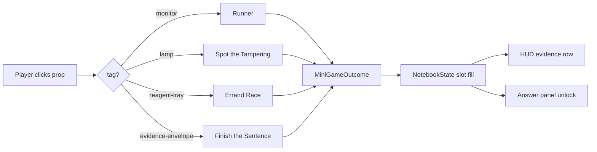
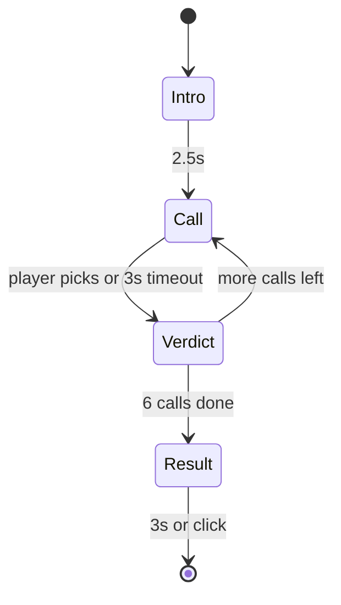
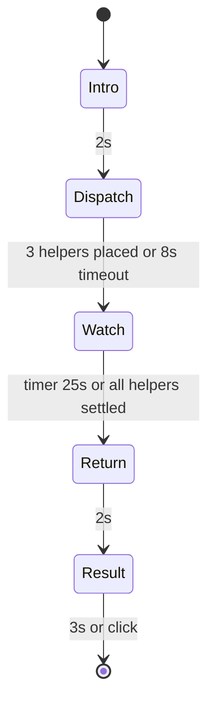
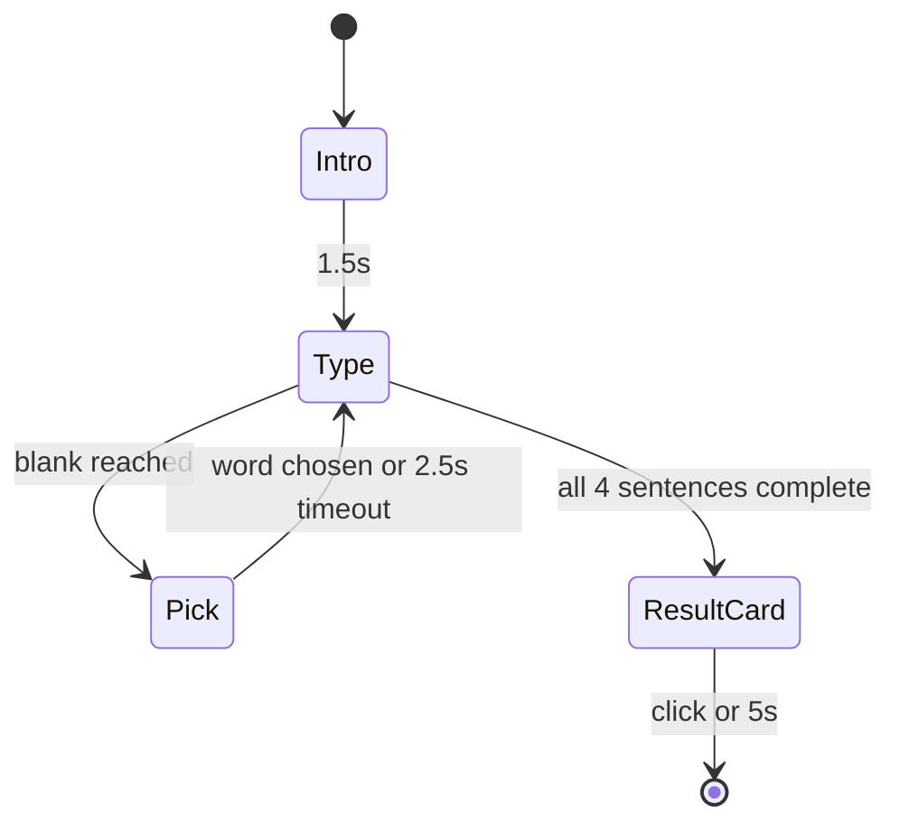

# Three Cursor-themed minigames

## Context

The game has 4 minigame slots wired through [`bug-detective/src/game/notebook.ts`](bug-detective/src/game/notebook.ts) and [`bug-detective/src/game/score.ts`](bug-detective/src/game/score.ts). Each minigame is a session class (see [`bug-detective/src/minigames/lamp/lampSession.ts`](bug-detective/src/minigames/lamp/lampSession.ts)) that renders to a fixed canvas, attaches pointer/keyboard handlers, and produces a `MiniGameOutcome { clueToken, score }`.

The current four (runner, envelope cipher, reagent mix, lamp spectrum) are too technical and low-fun. The plan keeps the **runner** and replaces the other three with universally legible games whose verbs anyone understands, each subtly themed to one Cursor pillar.

## Decisions taken (override before implementation)

- **Lineup**: runner (kept) + 3 new = 4 minis. Notebook stays at 4 slots.
- **Prop mapping** (which 3D prop opens which mini):
  - `monitor` -> Runner (unchanged)
  - `lamp` -> Spot the Tampering (lamp shines on photo pair)
  - `reagent-tray` -> Errand Race (5 wells reskinned as drawers)
  - `evidence-envelope` -> Finish the Sentence (envelope opens to typewriter)
- **Slot rename** in [`notebook.ts`](bug-detective/src/game/notebook.ts) for clarity: `runner | sticky | clock | photo` -> `runner | sentence | errand | tamper`. Score weights: equal `0.25` each.
- **Old code is deleted**, not deprecated. Files under `bug-detective/src/minigames/{envelope,reagent,lamp}/` removed at the end.
- **3D prop tags stay the same** (`monitor`, `evidence-envelope`, `reagent-tray`, `lamp`) so anomaly targeting and hover hints keep working. Only the launcher in [`main.ts`](bug-detective/src/main.ts) changes which session opens.
- **No new audio assets** in v1.
- **Share card** for Finish the Sentence is in scope (extends [`shareCard.ts`](bug-detective/src/ui/shareCard.ts) pattern).

## High-level flow



---

## Game 1: Spot the Tampering (Bugbot)

### Design

Two photos of the desk side-by-side: ORIGINAL (left), TONIGHT (right). Bugbot circles spots on TONIGHT one at a time and announces a verdict with confidence. Player Agrees, Disagrees, or Disagrees + taps the real tampering.

### State machine



- **Intro** 2.5s: title card "TAMPERING - agree or disagree with Bugbot".
- **Call** ~3s window: Bugbot speech bubble + circle on TONIGHT. Buttons: AGREE / DISAGREE.
- If DISAGREE chosen and Bugbot's claim was "clean", a 2s sub-state lets the player tap the real tampered spot.
- 6 calls per round.
- **Result** card with score, streak, accuracy.

### Data shapes

```ts
type SceneId = "case-file-set" | "evidence-bench" | "lamp-corner";
interface TamperSpot { id: string; x: number; y: number; r: number; tampered: boolean; }
interface TamperScene { id: SceneId; bg: string; spots: TamperSpot[]; }
interface TamperCall {
  callIndex: number;
  bugbotPointsAtSpotId: string;
  bugbotClaim: "tampered" | "clean";
  bugbotConfidencePct: number; // 60..99
  bugbotIsLying: boolean;
}
type CallVerdict =
  | { kind: "agree" }
  | { kind: "disagree" }
  | { kind: "disagree-point"; spotId: string };
```

### Scoring (0..1000)

- Right call: +150
- Wrong call: -75
- Caught Bugbot lying (`disagree-point` + correct spot): +250
- Final clamped to `[0, 1000]`.
- Always returns `clueToken` = day's word for the `tamper` slot regardless of score (slot fills if player completes 6 calls).

### Daily seed

`makeSeededRng(seed + ":tamper")` chooses the scene, the truth of each spot, which calls Bugbot lies on, and confidence values.

### Files (new)

- [`bug-detective/src/minigames/tamper/types.ts`](bug-detective/src/minigames/tamper/types.ts)
- [`bug-detective/src/minigames/tamper/scenes.ts`](bug-detective/src/minigames/tamper/scenes.ts) - 3 hand-painted desk scenes drawn procedurally on canvas (no image assets), each with 5 candidate spots
- [`bug-detective/src/minigames/tamper/draw.ts`](bug-detective/src/minigames/tamper/draw.ts) - bug bot speech bubble, circle, side-by-side panels
- [`bug-detective/src/minigames/tamper/clueTokens.ts`](bug-detective/src/minigames/tamper/clueTokens.ts) - returns clue word from anomaly's `gameClueWords.tamper`
- [`bug-detective/src/minigames/tamper/tamperSession.ts`](bug-detective/src/minigames/tamper/tamperSession.ts) - main session class matching the `LampSession` interface

### Tests

- [`bug-detective/tests/tamper.test.ts`](bug-detective/tests/tamper.test.ts):
  - Same seed produces identical call list
  - Score calculation: 6 right -> 900; 6 wrong -> 0; 3 right + 3 caught lies -> 1000 (clamped)
  - "disagree-point" with wrong spot is treated as wrong call

---

## Game 2: Errand Race (Cloud Agent)

### Design

5 drawers in a row (top half), 3 helper mascots (bottom). Drag each helper onto a drawer. Helpers fill progress bars at different rates. Some drawers trigger an ABORT prompt mid-fill: 50/50 push-or-abort decision. Drawer contents: clue / junk / trap.

### State machine



- **Intro** 2s: title + tutorial gate.
- **Dispatch**: drag 3 helpers from bottom to drawers. Cannot place 2 on the same drawer. Auto-assigns to nearest empty drawer if player times out.
- **Watch**: progress bars fill. Trap drawer raises `trap_alert` mid-fill at random 30..70% of bar. Player has 2s to click ABORT (helper returns empty + safe) or PUSH (50/50 -> clue or `lost`). Pushed-and-lost helpers do not return.
- **Return**: helpers walk back, deposit clue cards.
- **Result**: clue count, helpers safe, score.

### Data shapes

```ts
type HintIcon = "cup" | "feather" | "key" | "question" | "warn";
type DrawerContent = "clue" | "junk" | "trap";
interface Drawer { index: 0|1|2|3|4; hint: HintIcon; content: DrawerContent; fillRateMs: number; }
interface Helper {
  index: 0|1|2;
  state: "waiting" | "moving" | "filling" | "alert" | "returning" | "lost";
  drawerAssigned: number | null;
  fillProgress: number; // 0..1
  result: "clue" | "junk" | null;
}
```

### Scoring (0..1000)

- 0 clues: 0 (and `clueToken` not produced -> slot stays empty, must replay)
- 1 clue: 400
- 2 clues: 700
- 3 clues: 1000
- All 3 helpers safe: +50
- Each helper lost: -100
- Floor 0, cap 1000.

### Daily seed

`makeSeededRng(seed + ":errand")` chooses each drawer's content, hint icon, fill rate, and the alert trigger time.

Hint reliability: each scene defines a `hintTruthMap` so e.g. `cup` -> usually clue, `warn` -> usually trap, but with daily noise. Players learn the day's mapping in the first 2-3 plays.

### Files (new)

- [`bug-detective/src/minigames/errand/types.ts`](bug-detective/src/minigames/errand/types.ts)
- [`bug-detective/src/minigames/errand/drawers.ts`](bug-detective/src/minigames/errand/drawers.ts) - hint icon SVGs/canvas calls, daily content distribution
- [`bug-detective/src/minigames/errand/draw.ts`](bug-detective/src/minigames/errand/draw.ts) - drawers, helpers, progress bars, ABORT modal
- [`bug-detective/src/minigames/errand/clueTokens.ts`](bug-detective/src/minigames/errand/clueTokens.ts)
- [`bug-detective/src/minigames/errand/errandSession.ts`](bug-detective/src/minigames/errand/errandSession.ts) - session + drag handlers + abort timer

### Tests

- [`bug-detective/tests/errand.test.ts`](bug-detective/tests/errand.test.ts):
  - Same seed produces same drawer layout
  - 3 clues -> score 1000 + safe bonus
  - 0 clues -> outcome null
  - Aborted trap helpers count as safe + empty
  - Cannot place two helpers on the same drawer

---

## Game 3: Finish the Sentence (Tab autocomplete)

### Design

A typewriter clack-types a 4-sentence case file. Each sentence has 1 blank. When the typewriter hits a blank, 3 ghost-text suggestions float in (blue = right, purple = funny, orange = honest mistake). Tap one. Idle ~2.5s -> typewriter "panics" and picks the orange one.

### Two scores + four endings

| Path | Title stamped | Card vibe |
|------|---------------|-----------|
| 4/4 right (blue) | "By the Book Detective" | Crisp, classy |
| 3+ funny (purple) | "Cursed Case File" | Comic Sans, ketchup stain |
| Mixed | "Improv Detective" | Marker on napkin |
| 2+ idle/orange | "The Typewriter Wrote It For You" | Sad font, single tear |

The full assembled paragraph is rendered as a share-card via the [`shareCard.ts`](bug-detective/src/ui/shareCard.ts) pattern.

### Wow moment

If the player picks 3 blue in a row, the next sentence's prefix injects the player's name token (e.g. `"and then you noticed something off"` -> `"and then [Player] noticed something off"`), provided a name is available.

### State machine



### Data shapes

```ts
type PickColor = "blue" | "purple" | "orange";
interface SentenceSlot {
  prefix: string;
  options: { blue: string; purple: string; orange: string };
  suffix: string;
}
interface SentenceTemplate {
  id: string;             // anomaly-specific id
  slots: SentenceSlot[];  // length 4
}
interface PlayerPick { sentenceIdx: number; color: PickColor | "idle"; }
```

### Scoring (0..1000)

- Per sentence:
  - Blue pick: +250
  - Purple pick: +150
  - Orange pick: 0
  - Idle (timeout): -50
- Final clamped to `[0, 1000]`.
- Outcome `clueToken` = day's word for the `sentence` slot, set if at least 1 blue picked. Otherwise outcome is null and the slot stays empty.

### Daily seed

`makeSeededRng(seed + ":sentence")` picks the template per anomaly + small variance per slot (e.g., funny option chosen from a pool of 3).

### Files (new)

- [`bug-detective/src/minigames/sentence/types.ts`](bug-detective/src/minigames/sentence/types.ts)
- [`bug-detective/src/minigames/sentence/templates.ts`](bug-detective/src/minigames/sentence/templates.ts) - one `SentenceTemplate` per anomaly id (12 templates)
- [`bug-detective/src/minigames/sentence/draw.ts`](bug-detective/src/minigames/sentence/draw.ts) - typewriter scroll, ghost-text balloons, share card layouts (4 endings)
- [`bug-detective/src/minigames/sentence/clueTokens.ts`](bug-detective/src/minigames/sentence/clueTokens.ts)
- [`bug-detective/src/minigames/sentence/sentenceSession.ts`](bug-detective/src/minigames/sentence/sentenceSession.ts) - session + typing tween + result card

### Tests

- [`bug-detective/tests/sentence.test.ts`](bug-detective/tests/sentence.test.ts):
  - Each anomaly has a template
  - All 4 blue -> score 1000 + "by the book" ending
  - All 4 idle -> outcome null + "typewriter wrote it" ending
  - Same seed -> same options
  - Name injection only fires after 3 consecutive blue

---

## Shared changes

### Notebook + score (slot rename)

- [`bug-detective/src/game/notebook.ts`](bug-detective/src/game/notebook.ts): `NotebookSlot = "runner" | "sentence" | "errand" | "tamper"`.
- [`bug-detective/src/game/score.ts`](bug-detective/src/game/score.ts):
  - `W` weights -> `runner: 0.25, sentence: 0.25, errand: 0.25, tamper: 0.25`
  - `perGameScores` maps new slot names
  - `GAME_SCORE_LABEL`: `runner: "RUN"`, `sentence: "WORD"`, `errand: "DASH"`, `tamper: "EYE"`
  - `formatGameScoresDetail` slots array updated
- [`bug-detective/src/game/gameState.ts`](bug-detective/src/game/gameState.ts): the "all 4 slots filled" check uses the new keys.

### Anomaly clue words

[`bug-detective/src/scene/anomalies.ts`](bug-detective/src/scene/anomalies.ts) `gameClueWords` keys rename:

```ts
readonly gameClueWords: {
  readonly runner: string;
  readonly sentence: string; // was sticky
  readonly errand: string;   // was clock
  readonly tamper: string;   // was photo
};
```

Existing string values are preserved per anomaly (just keys rename).

### HUD

[`bug-detective/src/ui/hud.ts`](bug-detective/src/ui/hud.ts):
- Slot loops at lines 70 and 190 use the new tuple `["runner", "sentence", "errand", "tamper"]`.
- Slot label map updated.

### Routing in main.ts

[`bug-detective/src/main.ts`](bug-detective/src/main.ts):
- Replace lamp-launch / reagent-launch / envelope-launch sites with tamper-launch / errand-launch / sentence-launch respectively, keyed off the same prop tags (`lamp`, `reagent-tray`, `evidence-envelope`).
- Each new session is constructed with the same `LampSessionOpts`-shaped params: `{ overlayCtx, getOverlayViewport, clueWord, onExit }`.
- After session completion, write outcome to the renamed notebook slot.
- Update `friendlyTagName` and `clueWord` plumbing if it referenced removed slots.

### Runner remains; only its slot key changes

[`bug-detective/src/minigames/runner/clueTokens.ts`](bug-detective/src/minigames/runner/clueTokens.ts) reads `def.gameClueWords.runner` - unchanged.

### 3D scene cleanup (small)

[`bug-detective/src/scene/desktopDiorama.ts`](bug-detective/src/scene/desktopDiorama.ts) keeps all four launcher props. Optional polish (out of scope unless trivial):
- Reagent tray: 5 wells already exist; can be re-tinted as drawer compartments.
- Lamp: keep current pose; the tampering game runs on the canvas overlay.
- Envelope: keep open animation as the "letter inside" cue.

[`bug-detective/src/scene/propInteractions.ts`](bug-detective/src/scene/propInteractions.ts): no change required - flavor tags are unaffected.

### Tests touched

- [`bug-detective/tests/notebook.test.ts`](bug-detective/tests/notebook.test.ts): rename slots.
- [`bug-detective/tests/score.test.ts`](bug-detective/tests/score.test.ts): rename slots, update weights expectations.
- [`bug-detective/tests/runnerSnippets.test.ts`](bug-detective/tests/runnerSnippets.test.ts): no change (uses anomaly id, not slot).

### Files deleted

- `bug-detective/src/minigames/envelope/` (entire folder)
- `bug-detective/src/minigames/reagent/` (entire folder)
- `bug-detective/src/minigames/lamp/` (entire folder)
- Any `bug-detective/tests/{envelope,reagent,lamp}*.test.ts` files (verify by listing tests dir).

After deletion: rg for `lampSession`, `reagentSession`, `envelopeSession`, `LampFilter`, `ReagentMix`, `EnvelopeCipher` and remove dead imports.

---

## Implementation order (staged checkpoints for cloud agent)

Each stage ends with `cd bug-detective && npm run build && npm test`. Do not advance until both pass.

1. **Stage 1 - Slot rename + scaffolding**
   - Rename `NotebookSlot` keys + update `score.ts`, `hud.ts`, `gameState.ts`, `anomalies.ts` `gameClueWords`, runner clueTokens reader.
   - Update `notebook.test.ts` and `score.test.ts`.
   - Build + tests green.

2. **Stage 2 - Spot the Tampering (replaces lamp launch)**
   - Add `tamper/` files + tests.
   - In `main.ts`, swap the `lamp` tag handler to launch `TamperSession`. Remove lamp imports.
   - Delete `bug-detective/src/minigames/lamp/`.
   - Build + tests green.

3. **Stage 3 - Errand Race (replaces reagent launch)**
   - Add `errand/` files + tests.
   - In `main.ts`, swap the `reagent-tray` tag handler. Remove reagent imports.
   - Delete `bug-detective/src/minigames/reagent/`.
   - Build + tests green.

4. **Stage 4 - Finish the Sentence (replaces envelope launch)**
   - Add `sentence/` files + tests, including 12 templates (one per anomaly id).
   - In `main.ts`, swap the `evidence-envelope` tag handler. Remove envelope imports.
   - Delete `bug-detective/src/minigames/envelope/`.
   - Build + tests green.

5. **Stage 5 - Cleanup pass**
   - rg for any remaining references to deleted modules; remove dead code.
   - Verify HUD shows new labels (RUN/WORD/DASH/EYE) and the case can be solved end-to-end.
   - Build + tests green.

## Verification

- `cd bug-detective && npm run build` clean.
- `cd bug-detective && npm test` all green.
- `rg -n "lampSession|reagentSession|envelopeSession|LampFilter|ReagentMix|EnvelopeCipher"` returns no results.
- Manual sanity (cloud agent should report skipped if no headed browser): each prop click opens the new mini; finishing a mini fills the matching HUD slot; submitting after all four wins the case.

## Risks / stop-and-report

- If anomaly `gameClueWords` shape change breaks the daily-seed clue derivation in [`anomalies.ts`](bug-detective/src/scene/anomalies.ts) `def.gameClueWords.photo` (line ~390 in current file), the agent should fix the call sites in the same stage rather than batch later.
- If the runner relied on a removed slot label anywhere (rg `"sticky"|"clock"|"photo"` to confirm), update or report.
- If a deleted mini was referenced from a test fixture, delete the fixture rather than restoring the mini.
- If the tutorial gate storage keys (`bd:miniTutorial:lamp` etc.) cause stale state in dev, leave new keys (`bd:miniTutorial:tamper` etc.) and don't migrate.

## Out of scope

- Audio for any new mini.
- 3D mascot meshes for Errand Race helpers (canvas-only sprites are fine in v1).
- Reagent tray prop visual rework (drawer-style retexture) - leave for a follow-up polish pass.
- Animated transitions between prop click and overlay open beyond what already exists.
- Localization of new strings.